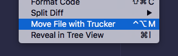
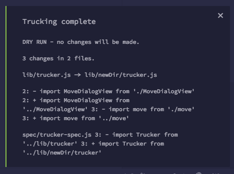

# atom-trucker 🚚

**IDE refactoring: Move files while maintaining dependencies**

Move or rename source files while fixing up the paths used in requires.

Supports:

* js, as parsed by babel (up to ES7)
* coffeescript

`apm install trucker`

Uses node-trucker under the hood 🚚. https://github.com/davidmfoley/node-trucker
