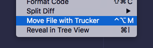
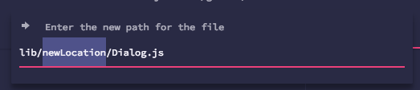
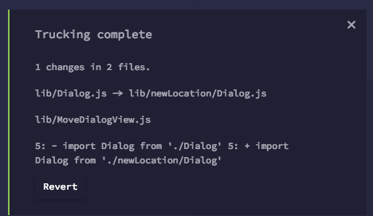

# atom-trucker 🚚

**IDE refactoring: move files while maintaining dependencies**

Move or rename source files while fixing up the paths used in requires.

#### Language Support

* js, as parsed by babel (up to ES7)
* coffeescript

#### How to

#### Installation

`apm install trucker` or search `trucker`

#### About

Uses node-trucker under the hood 🚚. https://github.com/davidmfoley/node-trucker
